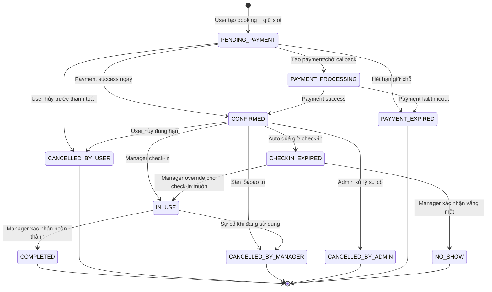
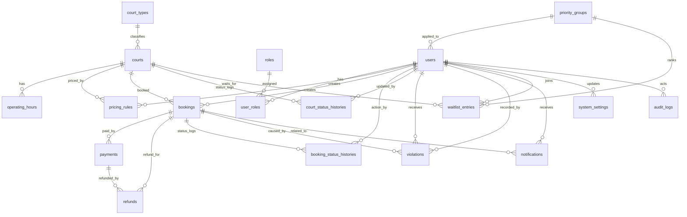

# FINAL SPECIFICATION — Hệ thống đặt sân thể thao trường học (CourtSphere)


> Tech stack chốt: **Node.js Express + React + PostgreSQL + Prisma**.  
> Database naming chốt: **snake_case, bảng số nhiều**.  
> Prisma naming chốt: **PascalCase model, camelCase field, map xuống snake_case bằng `@@map` và `@map` khi cần**.

---

## 0. Kết luận nghiệp vụ đã chốt

Đây là phần quan trọng nhất. Coding agent phải tuân thủ các quyết định sau, không quay lại các thiết kế cũ.

### 0.1 Hệ thống dùng cơ chế tự động xác nhận, không duyệt tay từng booking

Hệ thống **không dùng workflow quản trị viên duyệt/từ chối booking thông thường**.

Luồng đúng là:

```text
User chọn sân + khung giờ
        ↓
System kiểm tra điều kiện đặt sân
        ↓
System giữ chỗ tạm thời
        ↓
User thanh toán 100%
        ↓
Payment success
        ↓
Booking tự động chuyển CONFIRMED
```

Ban quản lý sân không duyệt trước booking. Ban quản lý chỉ tham gia ở các nghiệp vụ vận hành sau khi booking đã xác nhận, gồm:

- xác nhận người đặt đã đến sân;
- check-in;
- ghi nhận hoàn thành;
- xử lý quá giờ check-in/no-show;
- hủy booking do sân gặp sự cố/bảo trì/thời tiết/sự kiện đột xuất.

### 0.2 Ưu tiên không được “cướp slot” đã giữ hoặc đã thanh toán

Thứ tự ưu tiên mặc định:

```text
Cán bộ/Giảng viên > Sinh viên > Người ngoài trường
```

Priority chỉ ảnh hưởng:

1. số ngày được phép đặt trước;
2. quota đặt sân;
3. thứ tự danh sách chờ;
4. quyền đặt một số khung giờ ưu tiên nếu có cấu hình.

Priority **không override**:

- booking đã `CONFIRMED`;
- booking đang `PENDING_PAYMENT` và hold chưa hết hạn;
- payment đã thành công.

Ví dụ: người ngoài giữ slot trước và đang trong thời hạn thanh toán thì giảng viên vào sau không được cướp slot. Giảng viên có lợi thế thông qua advance booking window và waitlist, không phải cướp slot.

### 0.3 Chống đặt trùng bằng transaction/locking

Hệ thống phải chống race condition khi nhiều người đặt cùng sân/cùng khung giờ.

Điều kiện overlap:

```text
new_start < existing_end
AND
new_end > existing_start
```

Các trạng thái được coi là đang chiếm slot:

```text
PENDING_PAYMENT
PAYMENT_PROCESSING
CONFIRMED
IN_USE
```

Khi tạo booking phải dùng database transaction. Khuyến nghị PostgreSQL:

- transaction isolation `SERIALIZABLE`; hoặc
- advisory lock theo `court_id + date`; hoặc
- exclusion constraint bằng `tstzrange` nếu triển khai nâng cao.

### 0.4 User không tự check-in

Luồng check-in đúng:

```text
Người đặt đến sân
        ↓
Ban quản lý sân kiểm tra mã booking / thông tin người đặt
        ↓
Ban quản lý sân xác nhận check-in
        ↓
Booking chuyển IN_USE
```

Người dùng không có quyền tự chuyển booking sang `IN_USE`.

### 0.5 Quá giờ check-in và no-show

Khi booking đã đến giờ bắt đầu mà chưa được quản lý check-in:

```text
CONFIRMED
    ↓ auto job sau late_checkin_minutes
CHECKIN_EXPIRED
    ↓ manager xác nhận vắng mặt
NO_SHOW
```

`CHECKIN_EXPIRED` là trạng thái hệ thống đánh dấu quá giờ check-in. `NO_SHOW` là trạng thái ban quản lý xác nhận vắng mặt cuối cùng.

Quá giờ check-in/no-show:

- không hoàn tiền;
- có thể ghi nhận vi phạm;
- quản lý có thể override trong trường hợp đặc biệt, nhưng phải ghi rõ lý do và audit log.

### 0.6 Tên bảng/cột đã chốt

Các tên sau là nguồn chân lý:

```text
operating_hours
booking_status_histories
refunds
roles
user_roles
court_status_histories
system_settings
```

Không dùng lại các tên cũ như:

```text
court_schedule
booking_history
payment_refund
field_managers
```

### 0.7 Mô hình quyền đã chốt

Dùng RBAC:

```text
users
roles
user_roles
```

Không lưu `role` enum trực tiếp trong bảng `users`.

Một user có thể có nhiều role, ví dụ vừa là `USER`, vừa là `FIELD_MANAGER`.

---

## 1. Tổng quan hệ thống

Hệ thống đặt sân thể thao trường học quản lý:

- loại sân;
- sân/khu vực thể thao;
- khung giờ hoạt động;
- bảng giá;
- chính sách ưu tiên;
- đặt sân;
- thanh toán;
- hoàn tiền;
- check-in;
- no-show;
- vi phạm;
- thông báo;
- báo cáo thống kê;
- audit log.

Đối tượng sử dụng:

| Tác nhân | Vai trò trong hệ thống |
|---|---|
| Người đặt sân | Xem sân, xem lịch trống, đặt sân, thanh toán, hủy booking, xem lịch sử |
| Ban quản lý sân | Xác nhận check-in, hoàn thành, xử lý no-show, cập nhật trạng thái sân, hủy lịch do sân lỗi |
| Quản trị viên | Quản lý người dùng, role, sân, loại sân, bảng giá, quy định, thanh toán, hoàn tiền, vi phạm, báo cáo |
| Hệ thống | Tự động hủy đơn chờ thanh toán, đánh dấu quá giờ check-in, gửi thông báo, ghi lịch sử |
| Cổng thanh toán | Xử lý thanh toán và hoàn tiền |

---

## 2. Phạm vi MVP

MVP cần làm đủ các nghiệp vụ lõi sau:

1. Đăng ký, đăng nhập, phân quyền bằng RBAC.
2. Quản lý loại sân, sân, khung giờ hoạt động, bảng giá.
3. Xem danh sách sân và chi tiết sân.
4. Xem lịch trống theo ngày.
5. Tạo booking ở trạng thái `PENDING_PAYMENT` và giữ slot tạm thời.
6. Thanh toán 100% để xác nhận booking.
7. Hủy booking hợp lệ và tạo refund nếu đủ điều kiện.
8. Ban quản lý xác nhận check-in.
9. Ban quản lý ghi nhận hoàn thành.
10. Hệ thống đánh dấu quá giờ check-in.
11. Ban quản lý xác nhận no-show.
12. Ghi booking status history cho mọi chuyển trạng thái.
13. Dashboard/báo cáo cơ bản.

Phần có thể làm sau MVP:

- waitlist nâng cao;
- thông báo email/SMS/push;
- xuất Excel/PDF;
- chính sách giá theo ngày lễ/giờ cao điểm;
- phí sử dụng quá giờ;
- nhiều cơ sở/khu thể thao;
- đặt các tài nguyên khác như phòng học, hội trường, phòng lab.

---

## 3. Quy tắc nghiệp vụ

### 3.1 Thanh toán 100%

- Không đặt cọc.
- Booking chỉ được xác nhận khi thanh toán đủ 100%.
- Khi user tạo booking, hệ thống tạo trạng thái `PENDING_PAYMENT`.
- Slot được giữ trong `hold_minutes`, mặc định 10 phút.
- Nếu thanh toán thành công trước hạn, booking chuyển `CONFIRMED`.
- Nếu quá hạn giữ chỗ, booking chuyển `PAYMENT_EXPIRED` và slot mở lại.
- Nếu payment gateway đang xử lý, booking có thể chuyển `PAYMENT_PROCESSING` để chờ callback/đối soát.

### 3.2 Điều kiện tạo booking hợp lệ

Một booking request hợp lệ khi thỏa toàn bộ:

- user đã đăng nhập;
- account không bị `LOCKED` hoặc `DISABLED`;
- `booking_permission_status = ALLOWED`;
- sân đang `ACTIVE`;
- thời gian nằm trong `operating_hours`;
- ngày đặt không vượt `advance_booking_days` theo priority group;
- thời lượng không vượt `max_duration_minutes`;
- user chưa vượt `max_bookings_per_day`;
- số người không vượt sức chứa sân;
- không overlap với booking đang chiếm slot;
- không nằm trong thời gian sân bảo trì/tạm đóng.

### 3.3 Chính sách ưu tiên

Mặc định:

| Nhóm | priority_level | advance_booking_days |
|---|---:|---:|
| Cán bộ/Giảng viên | 1 | 14 |
| Sinh viên | 2 | 7 |
| Người ngoài trường | 3 | 3 |

Các giá trị này lưu trong `priority_groups`, không hard-code.

### 3.4 Hủy và hoàn tiền

| Trường hợp | Trạng thái sau hủy | Refund |
|---|---|---|
| User hủy đúng hạn | `CANCELLED_BY_USER` | Có, theo cấu hình |
| User hủy quá sát giờ | Từ chối hủy hoặc `CANCELLED_BY_USER` không refund tùy cấu hình | Không |
| Quá giờ check-in | `CHECKIN_EXPIRED` | Không |
| No-show | `NO_SHOW` | Không |
| Ban quản lý hủy do sân lỗi/bảo trì | `CANCELLED_BY_MANAGER` | Có, mặc định 100% |
| Admin hủy do lỗi hệ thống | `CANCELLED_BY_ADMIN` | Có, mặc định 100% |

Mặc định user không được hủy trong vòng `cancel_before_hours = 2` giờ trước giờ bắt đầu.

### 3.5 Vi phạm và khóa quyền đặt sân

Có thể ghi vi phạm cho:

- no-show;
- quá giờ check-in;
- hủy sát giờ nhiều lần;
- sử dụng quá giờ;
- vi phạm nội quy sân.

Khi `violation_points` vượt `violation_threshold`, hệ thống cập nhật:

```text
users.booking_permission_status = RESTRICTED
users.booking_locked_until = now + booking_ban_days
```

Admin có thể điều chỉnh/miễn vi phạm, nhưng phải nhập lý do và ghi `audit_logs`.

---

## 4. State machine

### 4.1 BookingStatus

```ts
enum BookingStatus {
  PENDING_PAYMENT
  PAYMENT_PROCESSING
  PAYMENT_EXPIRED
  CONFIRMED
  IN_USE
  COMPLETED
  CANCELLED_BY_USER
  CANCELLED_BY_MANAGER
  CANCELLED_BY_ADMIN
  CHECKIN_EXPIRED
  NO_SHOW
}
```

### 4.2 Sơ đồ chuyển trạng thái



### 4.3 PaymentStatus

```ts
enum PaymentStatus {
  INITIATED
  PROCESSING
  SUCCESS
  FAILED
  CANCELLED
  EXPIRED
}
```

### 4.4 RefundStatus

```ts
enum RefundStatus {
  REQUESTED
  PROCESSING
  SUCCESS
  FAILED
  MANUAL_REVIEW
  REJECTED
}
```

---

## 5. Database schema — nguồn chân lý

### 5.1 Danh sách bảng

| Bảng | Ý nghĩa |
|---|---|
| `priority_groups` | Nhóm ưu tiên: giảng viên/sinh viên/người ngoài |
| `users` | Tài khoản |
| `roles` | Danh mục role |
| `user_roles` | Bảng nhiều-nhiều user-role |
| `court_types` | Loại sân |
| `courts` | Sân |
| `operating_hours` | Khung giờ hoạt động |
| `pricing_rules` | Bảng giá |
| `bookings` | Đơn đặt sân |
| `payments` | Thanh toán |
| `refunds` | Hoàn tiền |
| `booking_status_histories` | Lịch sử trạng thái booking |
| `court_status_histories` | Lịch sử trạng thái sân |
| `violations` | Vi phạm |
| `notifications` | Thông báo |
| `waitlist_entries` | Danh sách chờ |
| `system_settings` | Cấu hình kỹ thuật/cấu hình lặt vặt |
| `audit_logs` | Audit log chung |

### 5.2 Phân vai cấu hình

Không để trùng source of truth.

- `priority_groups`: lưu chính sách ưu tiên có cấu trúc.
- `system_settings`: chỉ lưu cấu hình hệ thống dạng key-value như `hold_minutes`, `cancel_before_hours`, `late_checkin_minutes`, `max_bookings_per_day`, `max_duration_minutes`, `violation_threshold`, `booking_ban_days`, `refund_rate_user_on_time`, `refund_rate_manager_fault`.
- `pricing_rules`: lưu giá.
- `operating_hours`: lưu giờ hoạt động.

### 5.3 ERD Mermaid đồng bộ với relation diagram



### 5.4 Quan hệ FK chi tiết

```text
priority_groups.priority_group_id -> users.priority_group_id

users.user_id -> user_roles.user_id
roles.role_id -> user_roles.role_id

court_types.court_type_id -> courts.court_type_id

courts.court_id -> operating_hours.court_id
courts.court_id -> pricing_rules.court_id
users.user_id -> pricing_rules.created_by_user_id

users.user_id -> bookings.user_id
courts.court_id -> bookings.court_id
users.user_id -> bookings.cancelled_by_user_id
users.user_id -> bookings.checked_in_by_user_id
users.user_id -> bookings.completed_by_user_id
users.user_id -> bookings.no_show_marked_by_user_id

bookings.booking_id -> payments.booking_id
users.user_id -> payments.user_id

payments.payment_id -> refunds.payment_id
bookings.booking_id -> refunds.booking_id
users.user_id -> refunds.requested_by_user_id
users.user_id -> refunds.processed_by_user_id

bookings.booking_id -> booking_status_histories.booking_id
users.user_id -> booking_status_histories.action_by_user_id

courts.court_id -> court_status_histories.court_id
users.user_id -> court_status_histories.updated_by_user_id

users.user_id -> violations.user_id
bookings.booking_id -> violations.booking_id
users.user_id -> violations.recorded_by_user_id

users.user_id -> notifications.user_id
bookings.booking_id -> notifications.booking_id

users.user_id -> waitlist_entries.user_id
courts.court_id -> waitlist_entries.court_id
priority_groups.priority_group_id -> waitlist_entries.priority_group_id

users.user_id -> system_settings.updated_by_user_id
users.user_id -> audit_logs.actor_user_id
```

---

## 6. Prisma schema khởi tạo cuối cùng

> Schema này dùng UUID để dễ phát triển, phù hợp PostgreSQL + Prisma.  
> Database table name dùng snake_case số nhiều qua `@@map`.  
> Không còn `role` enum trong `users`; RBAC dùng `roles` + `user_roles`.

```prisma
generator client {
  provider = "prisma-client-js"
}

datasource db {
  provider = "postgresql"
  url      = env("DATABASE_URL")
}

enum AccountStatus {
  ACTIVE
  LOCKED
  DISABLED
}

enum BookingPermissionStatus {
  ALLOWED
  RESTRICTED
}

enum EntityStatus {
  ACTIVE
  INACTIVE
}

enum CourtStatus {
  ACTIVE
  MAINTENANCE
  TEMP_CLOSED
  RETIRED
}

enum BookingStatus {
  PENDING_PAYMENT
  PAYMENT_PROCESSING
  PAYMENT_EXPIRED
  CONFIRMED
  IN_USE
  COMPLETED
  CANCELLED_BY_USER
  CANCELLED_BY_MANAGER
  CANCELLED_BY_ADMIN
  CHECKIN_EXPIRED
  NO_SHOW
}

enum PaymentStatus {
  INITIATED
  PROCESSING
  SUCCESS
  FAILED
  CANCELLED
  EXPIRED
}

enum RefundStatus {
  REQUESTED
  PROCESSING
  SUCCESS
  FAILED
  MANUAL_REVIEW
  REJECTED
}

enum ViolationType {
  LATE_CANCEL
  CHECKIN_EXPIRED
  NO_SHOW
  OVERTIME_USAGE
  POLICY_VIOLATION
}

enum NotificationType {
  BOOKING_CREATED
  PAYMENT_SUCCESS
  PAYMENT_EXPIRED
  BOOKING_CANCELLED
  REFUND_REQUESTED
  REFUND_SUCCESS
  CHECKIN_EXPIRED
  NO_SHOW
  VIOLATION_RECORDED
  BOOKING_PERMISSION_RESTRICTED
  SYSTEM
}

enum WaitlistStatus {
  WAITING
  NOTIFIED
  BOOKED
  CANCELLED
  EXPIRED
}

model PriorityGroup {
  priorityGroupId    String       @id @default(uuid()) @map("priority_group_id")
  groupName          String       @unique @map("group_name")
  priorityLevel      Int          @map("priority_level")
  advanceBookingDays Int          @map("advance_booking_days")
  description        String?
  status             EntityStatus @default(ACTIVE)
  createdAt          DateTime     @default(now()) @map("created_at")
  updatedAt          DateTime     @updatedAt @map("updated_at")

  users              User[]
  waitlistEntries    WaitlistEntry[]

  @@index([priorityLevel])
  @@map("priority_groups")
}

model User {
  userId                  String                  @id @default(uuid()) @map("user_id")
  priorityGroupId          String?                 @map("priority_group_id")
  fullName                String                  @map("full_name")
  email                   String                  @unique
  phoneNumber             String?                 @unique @map("phone_number")
  passwordHash            String                  @map("password_hash")
  identityCode            String?                 @unique @map("identity_code")
  accountStatus           AccountStatus           @default(ACTIVE) @map("account_status")
  bookingPermissionStatus BookingPermissionStatus @default(ALLOWED) @map("booking_permission_status")
  bookingLockedUntil      DateTime?               @map("booking_locked_until")
  violationPoints         Int                     @default(0) @map("violation_points")
  reputationPoints        Int                     @default(100) @map("reputation_points")
  createdAt               DateTime                @default(now()) @map("created_at")
  updatedAt               DateTime                @updatedAt @map("updated_at")

  priorityGroup           PriorityGroup?          @relation(fields: [priorityGroupId], references: [priorityGroupId])
  userRoles               UserRole[]
  bookings                Booking[]              @relation("BookingOwner")
  cancelledBookings       Booking[]              @relation("BookingCancelledBy")
  checkedInBookings       Booking[]              @relation("BookingCheckedInBy")
  completedBookings       Booking[]              @relation("BookingCompletedBy")
  noShowMarkedBookings    Booking[]              @relation("BookingNoShowMarkedBy")
  payments                Payment[]
  requestedRefunds        Refund[]               @relation("RefundRequestedBy")
  processedRefunds        Refund[]               @relation("RefundProcessedBy")
  bookingStatusHistories  BookingStatusHistory[]
  courtStatusHistories    CourtStatusHistory[]
  violations              Violation[]            @relation("ViolationUser")
  recordedViolations      Violation[]            @relation("ViolationRecordedBy")
  notifications           Notification[]
  waitlistEntries         WaitlistEntry[]
  updatedSystemSettings   SystemSetting[]
  auditLogs               AuditLog[]
  createdPricingRules     PricingRule[]

  @@index([priorityGroupId])
  @@index([accountStatus])
  @@index([bookingPermissionStatus])
  @@map("users")
}

model Role {
  roleId      String     @id @default(uuid()) @map("role_id")
  roleName    String     @unique @map("role_name")
  description String?
  createdAt   DateTime   @default(now()) @map("created_at")
  updatedAt   DateTime   @updatedAt @map("updated_at")

  userRoles   UserRole[]

  @@map("roles")
}

model UserRole {
  userId     String   @map("user_id")
  roleId     String   @map("role_id")
  assignedAt DateTime @default(now()) @map("assigned_at")

  user       User     @relation(fields: [userId], references: [userId], onDelete: Cascade)
  role       Role     @relation(fields: [roleId], references: [roleId], onDelete: Cascade)

  @@id([userId, roleId])
  @@map("user_roles")
}

model CourtType {
  courtTypeId String       @id @default(uuid()) @map("court_type_id")
  typeName    String       @unique @map("type_name")
  description String?
  status      EntityStatus @default(ACTIVE)
  createdAt   DateTime     @default(now()) @map("created_at")
  updatedAt   DateTime     @updatedAt @map("updated_at")

  courts      Court[]

  @@map("court_types")
}

model Court {
  courtId               String               @id @default(uuid()) @map("court_id")
  courtTypeId           String               @map("court_type_id")
  courtName             String               @map("court_name")
  location              String
  capacity              Int
  description           String?
  imageUrl              String?              @map("image_url")
  status                CourtStatus          @default(ACTIVE)
  createdAt             DateTime             @default(now()) @map("created_at")
  updatedAt             DateTime             @updatedAt @map("updated_at")

  courtType             CourtType            @relation(fields: [courtTypeId], references: [courtTypeId])
  operatingHours        OperatingHour[]
  pricingRules          PricingRule[]
  bookings              Booking[]
  courtStatusHistories  CourtStatusHistory[]
  waitlistEntries       WaitlistEntry[]

  @@index([courtTypeId])
  @@index([status])
  @@map("courts")
}

model OperatingHour {
  operatingHourId    String       @id @default(uuid()) @map("operating_hour_id")
  courtId            String       @map("court_id")
  weekday            Int
  openTime           String       @map("open_time")
  closeTime          String       @map("close_time")
  slotDurationMinutes Int         @default(60) @map("slot_duration_minutes")
  status             EntityStatus @default(ACTIVE)
  createdAt          DateTime     @default(now()) @map("created_at")
  updatedAt          DateTime     @updatedAt @map("updated_at")

  court              Court        @relation(fields: [courtId], references: [courtId])

  @@unique([courtId, weekday])
  @@index([courtId, weekday])
  @@map("operating_hours")
}

model PricingRule {
  pricingRuleId     String       @id @default(uuid()) @map("pricing_rule_id")
  courtId           String       @map("court_id")
  createdByUserId   String?      @map("created_by_user_id")
  startTime         String       @map("start_time")
  endTime           String       @map("end_time")
  applicableDay     Int?         @map("applicable_day")
  priceAmount       Decimal      @db.Decimal(12, 2) @map("price_amount")
  priorityGroupId   String?      @map("priority_group_id")
  effectiveFrom     DateTime?    @map("effective_from")
  effectiveTo       DateTime?    @map("effective_to")
  status            EntityStatus @default(ACTIVE)
  createdAt         DateTime     @default(now()) @map("created_at")
  updatedAt         DateTime     @updatedAt @map("updated_at")

  court             Court        @relation(fields: [courtId], references: [courtId])
  createdBy         User?        @relation(fields: [createdByUserId], references: [userId])

  @@index([courtId])
  @@index([priorityGroupId])
  @@map("pricing_rules")
}

model Booking {
  bookingId              String        @id @default(uuid()) @map("booking_id")
  bookingCode            String        @unique @map("booking_code")
  userId                 String        @map("user_id")
  courtId                String        @map("court_id")
  startDatetime          DateTime      @map("start_datetime")
  endDatetime            DateTime      @map("end_datetime")
  participantCount       Int           @map("participant_count")
  usagePurpose           String        @map("usage_purpose")
  totalAmount            Decimal       @db.Decimal(12, 2) @map("total_amount")
  bookingStatus          BookingStatus @default(PENDING_PAYMENT) @map("booking_status")
  paymentStatus          PaymentStatus @default(INITIATED) @map("payment_status")
  refundable             Boolean       @default(true)
  holdExpiresAt          DateTime?     @map("hold_expires_at")
  cancelReason           String?       @map("cancel_reason")
  cancelledByUserId      String?       @map("cancelled_by_user_id")
  cancelledAt            DateTime?     @map("cancelled_at")
  checkedInByUserId      String?       @map("checked_in_by_user_id")
  completedByUserId      String?       @map("completed_by_user_id")
  noShowMarkedByUserId   String?       @map("no_show_marked_by_user_id")
  managerNote            String?       @map("manager_note")
  noRefundReason         String?       @map("no_refund_reason")
  checkinTime            DateTime?     @map("checkin_time")
  checkoutTime           DateTime?     @map("checkout_time")
  createdAt              DateTime      @default(now()) @map("created_at")
  updatedAt              DateTime      @updatedAt @map("updated_at")

  user                   User          @relation("BookingOwner", fields: [userId], references: [userId])
  court                  Court         @relation(fields: [courtId], references: [courtId])
  cancelledBy            User?         @relation("BookingCancelledBy", fields: [cancelledByUserId], references: [userId])
  checkedInBy            User?         @relation("BookingCheckedInBy", fields: [checkedInByUserId], references: [userId])
  completedBy            User?         @relation("BookingCompletedBy", fields: [completedByUserId], references: [userId])
  noShowMarkedBy         User?         @relation("BookingNoShowMarkedBy", fields: [noShowMarkedByUserId], references: [userId])
  payments               Payment[]
  refunds                Refund[]
  bookingStatusHistories BookingStatusHistory[]
  violations             Violation[]
  notifications          Notification[]

  @@index([userId])
  @@index([courtId, startDatetime, endDatetime])
  @@index([bookingStatus])
  @@index([paymentStatus])
  @@map("bookings")
}

model Payment {
  paymentId            String        @id @default(uuid()) @map("payment_id")
  bookingId            String        @map("booking_id")
  userId               String        @map("user_id")
  amount               Decimal       @db.Decimal(12, 2)
  paymentMethod        String        @map("payment_method")
  gatewayTransactionId String?       @unique @map("gateway_transaction_id")
  paymentStatus        PaymentStatus @default(INITIATED) @map("payment_status")
  rawCallback          Json?         @map("raw_callback")
  paidAt               DateTime?     @map("paid_at")
  createdAt            DateTime      @default(now()) @map("created_at")
  updatedAt            DateTime      @updatedAt @map("updated_at")

  booking              Booking       @relation(fields: [bookingId], references: [bookingId])
  user                 User          @relation(fields: [userId], references: [userId])
  refunds              Refund[]

  @@index([bookingId])
  @@index([userId])
  @@index([paymentStatus])
  @@map("payments")
}

model Refund {
  refundId            String       @id @default(uuid()) @map("refund_id")
  paymentId           String       @map("payment_id")
  bookingId           String       @map("booking_id")
  refundAmount        Decimal      @db.Decimal(12, 2) @map("refund_amount")
  refundReason        String       @map("refund_reason")
  refundStatus        RefundStatus @default(REQUESTED) @map("refund_status")
  requestedByUserId   String?      @map("requested_by_user_id")
  processedByUserId   String?      @map("processed_by_user_id")
  gatewayRefundId     String?      @unique @map("gateway_refund_id")
  requestedAt         DateTime     @default(now()) @map("requested_at")
  processedAt         DateTime?    @map("processed_at")
  updatedAt           DateTime     @updatedAt @map("updated_at")

  payment             Payment      @relation(fields: [paymentId], references: [paymentId])
  booking             Booking      @relation(fields: [bookingId], references: [bookingId])
  requestedBy         User?        @relation("RefundRequestedBy", fields: [requestedByUserId], references: [userId])
  processedBy         User?        @relation("RefundProcessedBy", fields: [processedByUserId], references: [userId])

  @@index([paymentId])
  @@index([bookingId])
  @@index([refundStatus])
  @@map("refunds")
}

model BookingStatusHistory {
  bookingStatusHistoryId String         @id @default(uuid()) @map("booking_status_history_id")
  bookingId              String         @map("booking_id")
  actionByUserId         String?        @map("action_by_user_id")
  oldStatus              BookingStatus? @map("old_status")
  newStatus              BookingStatus  @map("new_status")
  actionType             String         @map("action_type")
  note                   String?
  changedAt              DateTime       @default(now()) @map("changed_at")

  booking                Booking        @relation(fields: [bookingId], references: [bookingId])
  actionBy               User?          @relation(fields: [actionByUserId], references: [userId])

  @@index([bookingId])
  @@index([actionByUserId])
  @@map("booking_status_histories")
}

model CourtStatusHistory {
  courtStatusHistoryId String      @id @default(uuid()) @map("court_status_history_id")
  courtId              String      @map("court_id")
  updatedByUserId      String?     @map("updated_by_user_id")
  oldStatus            CourtStatus @map("old_status")
  newStatus            CourtStatus @map("new_status")
  reason               String?
  updatedAt            DateTime    @default(now()) @map("updated_at")

  court                Court       @relation(fields: [courtId], references: [courtId])
  updatedBy            User?       @relation(fields: [updatedByUserId], references: [userId])

  @@index([courtId])
  @@map("court_status_histories")
}

model Violation {
  violationId       String        @id @default(uuid()) @map("violation_id")
  userId            String        @map("user_id")
  bookingId         String?       @map("booking_id")
  violationType     ViolationType @map("violation_type")
  penaltyPoints     Int           @map("penalty_points")
  description       String?
  recordedByUserId  String?       @map("recorded_by_user_id")
  isWaived          Boolean       @default(false) @map("is_waived")
  recordedAt        DateTime      @default(now()) @map("recorded_at")

  user              User          @relation("ViolationUser", fields: [userId], references: [userId])
  booking           Booking?      @relation(fields: [bookingId], references: [bookingId])
  recordedBy        User?         @relation("ViolationRecordedBy", fields: [recordedByUserId], references: [userId])

  @@index([userId])
  @@index([bookingId])
  @@map("violations")
}

model Notification {
  notificationId   String           @id @default(uuid()) @map("notification_id")
  userId           String           @map("user_id")
  bookingId        String?          @map("booking_id")
  title            String
  content          String
  notificationType NotificationType @map("notification_type")
  channel          String           @default("IN_APP")
  isRead           Boolean          @default(false) @map("is_read")
  createdAt        DateTime         @default(now()) @map("created_at")

  user             User             @relation(fields: [userId], references: [userId])
  booking          Booking?         @relation(fields: [bookingId], references: [bookingId])

  @@index([userId])
  @@index([bookingId])
  @@map("notifications")
}

model WaitlistEntry {
  waitlistEntryId     String         @id @default(uuid()) @map("waitlist_entry_id")
  userId              String         @map("user_id")
  courtId             String         @map("court_id")
  priorityGroupId     String?        @map("priority_group_id")
  desiredStartDatetime DateTime      @map("desired_start_datetime")
  desiredEndDatetime   DateTime      @map("desired_end_datetime")
  priorityOrder       Int?           @map("priority_order")
  status              WaitlistStatus @default(WAITING)
  registeredAt        DateTime       @default(now()) @map("registered_at")
  notifiedAt          DateTime?      @map("notified_at")
  expiresAt           DateTime?      @map("expires_at")

  user                User           @relation(fields: [userId], references: [userId])
  court               Court          @relation(fields: [courtId], references: [courtId])
  priorityGroup       PriorityGroup? @relation(fields: [priorityGroupId], references: [priorityGroupId])

  @@unique([userId, courtId, desiredStartDatetime, desiredEndDatetime])
  @@index([courtId, desiredStartDatetime, desiredEndDatetime])
  @@map("waitlist_entries")
}

model SystemSetting {
  systemSettingId String   @id @default(uuid()) @map("system_setting_id")
  settingKey      String   @unique @map("setting_key")
  settingValue    String   @map("setting_value")
  description     String?
  updatedByUserId String?  @map("updated_by_user_id")
  updatedAt       DateTime @updatedAt @map("updated_at")

  updatedBy       User?    @relation(fields: [updatedByUserId], references: [userId])

  @@map("system_settings")
}

model AuditLog {
  auditLogId   String   @id @default(uuid()) @map("audit_log_id")
  actorUserId  String?  @map("actor_user_id")
  entityType   String   @map("entity_type")
  entityId     String?  @map("entity_id")
  action       String
  oldValue     Json?    @map("old_value")
  newValue     Json?    @map("new_value")
  ipAddress    String?  @map("ip_address")
  userAgent    String?  @map("user_agent")
  createdAt    DateTime @default(now()) @map("created_at")

  actor        User?    @relation(fields: [actorUserId], references: [userId])

  @@index([actorUserId])
  @@index([entityType, entityId])
  @@map("audit_logs")
}
```

---

## 7. SQL constraint khuyến nghị cho PostgreSQL

Prisma chưa hỗ trợ đầy đủ exclusion constraint, nên sau migration có thể thêm SQL thủ công.

### 7.1 Chống overlap booking ở tầng DB

```sql
CREATE EXTENSION IF NOT EXISTS btree_gist;

ALTER TABLE bookings
ADD COLUMN IF NOT EXISTS booking_time_range tstzrange
GENERATED ALWAYS AS (tstzrange(start_datetime, end_datetime, '[)')) STORED;

CREATE INDEX IF NOT EXISTS bookings_time_range_idx
ON bookings USING gist (court_id, booking_time_range);

ALTER TABLE bookings
ADD CONSTRAINT no_overlapping_active_bookings
EXCLUDE USING gist (
  court_id WITH =,
  booking_time_range WITH &&
)
WHERE (
  booking_status IN (
    'PENDING_PAYMENT',
    'PAYMENT_PROCESSING',
    'CONFIRMED',
    'IN_USE'
  )
);
```

Nếu chưa dùng exclusion constraint, service tạo booking phải chạy trong transaction `SERIALIZABLE` hoặc dùng PostgreSQL advisory lock.

### 7.2 Advisory lock gợi ý

```sql
SELECT pg_advisory_xact_lock(hashtext(CONCAT(court_id, ':', DATE(start_datetime))));
```

---

## 8. Luồng nghiệp vụ chi tiết

### 8.1 Xem lịch trống

```text
1. User chọn sân + ngày
2. System lấy operating_hours theo court + weekday
3. System sinh danh sách slot theo slot_duration_minutes
4. System lấy bookings đang chiếm slot
5. System loại slot bị overlap
6. System tính giá theo pricing_rules
7. System trả về:
   - slot trống
   - slot đã bị giữ/chờ thanh toán
   - slot đã xác nhận
   - giá
   - chính sách hủy/check-in/refund áp dụng
```

### 8.2 Tạo booking giữ chỗ

```text
1. User gửi request court_id, start_datetime, end_datetime, participant_count, usage_purpose
2. System kiểm tra account/booking permission
3. System kiểm tra court ACTIVE
4. System kiểm tra priority group và advance_booking_days
5. System kiểm tra operating_hours
6. System kiểm tra quota/duration/capacity
7. System mở transaction
8. System lock theo court + date
9. System kiểm tra overlap lần cuối trong transaction
10. System tính total_amount
11. System tạo booking PENDING_PAYMENT + hold_expires_at
12. System tạo booking_status_histories
13. System commit
14. System trả booking + số tiền + deadline thanh toán
```

### 8.3 Thanh toán

```text
1. User chọn booking PENDING_PAYMENT
2. System kiểm tra booking còn hạn hold
3. System tạo payment INITIATED
4. System gọi payment gateway / sandbox
5. Gateway callback
6. System verify signature/idempotency
7. Nếu SUCCESS:
   - payment SUCCESS
   - booking CONFIRMED
   - booking.payment_status SUCCESS
   - ghi booking_status_histories
   - gửi notification
8. Nếu FAILED/CANCELLED/EXPIRED:
   - payment cập nhật trạng thái tương ứng
   - booking vẫn PENDING_PAYMENT nếu hold chưa hết hạn
   - nếu hold hết hạn thì PAYMENT_EXPIRED
```

### 8.4 User hủy booking

```text
1. User yêu cầu hủy booking
2. System kiểm tra booking thuộc user
3. System kiểm tra trạng thái hợp lệ
4. Nếu PENDING_PAYMENT:
   - chuyển CANCELLED_BY_USER
   - không refund
5. Nếu CONFIRMED:
   - kiểm tra now <= start_datetime - cancel_before_hours
   - nếu đúng hạn: chuyển CANCELLED_BY_USER + tạo refund
   - nếu quá hạn: từ chối hoặc hủy không refund tùy config
6. Ghi booking_status_histories
7. Gửi notification
```

### 8.5 Manager check-in

```text
1. Manager mở lịch sử dụng hôm nay
2. Manager tìm booking theo mã booking/user/court/time
3. Manager kiểm tra người đến sân
4. Manager bấm xác nhận check-in
5. System kiểm tra role FIELD_MANAGER/ADMIN
6. System kiểm tra booking CONFIRMED hoặc CHECKIN_EXPIRED có override
7. System cập nhật:
   - booking_status = IN_USE
   - checkin_time = now
   - checked_in_by_user_id = manager.user_id
8. Ghi booking_status_histories
```

### 8.6 Auto quá giờ check-in

```text
1. Cron chạy mỗi phút
2. Tìm booking CONFIRMED có now > start_datetime + late_checkin_minutes
3. Nếu chưa checkin_time:
   - chuyển CHECKIN_EXPIRED
   - refundable = false
   - no_refund_reason = CHECKIN_EXPIRED
   - ghi history
   - gửi notification cho user và manager
```

### 8.7 Manager xác nhận no-show

```text
1. Manager mở danh sách CHECKIN_EXPIRED
2. Manager xác nhận NO_SHOW hoặc override
3. Nếu NO_SHOW:
   - booking_status = NO_SHOW
   - no_show_marked_by_user_id = manager.user_id
   - tạo violation
   - cộng điểm user
   - kiểm tra ngưỡng khóa quyền đặt sân
   - không tạo refund
4. Ghi booking_status_histories và audit_logs nếu có điều chỉnh đặc biệt
```

### 8.8 Manager/Admin hủy do sân lỗi

```text
1. Manager/Admin cập nhật sân MAINTENANCE/TEMP_CLOSED hoặc chọn booking bị ảnh hưởng
2. System tìm booking CONFIRMED/IN_USE tương ứng
3. Manager nhập lý do
4. System chuyển CANCELLED_BY_MANAGER hoặc CANCELLED_BY_ADMIN
5. System tạo refund 100% cho payment SUCCESS
6. Ghi court_status_histories nếu trạng thái sân thay đổi
7. Ghi booking_status_histories
8. Gửi notification
```

---

## 9. Backend API

### 9.1 Chuẩn response

```ts
type ApiSuccess<T> = {
  success: true;
  data: T;
  message?: string;
};

type ApiError = {
  success: false;
  error: {
    code: string;
    message: string;
    details?: unknown;
  };
};
```

### 9.2 Auth & RBAC

| Method | Endpoint | Quyền | Mục đích |
|---|---|---|---|
| POST | `/api/auth/register` | Public | Đăng ký |
| POST | `/api/auth/login` | Public | Đăng nhập |
| POST | `/api/auth/logout` | Auth | Đăng xuất |
| GET | `/api/auth/me` | Auth | User hiện tại |
| POST | `/api/auth/refresh` | Auth | Refresh token |
| GET | `/api/admin/roles` | ADMIN | Danh sách role |
| POST | `/api/admin/users/:id/roles` | ADMIN | Gán role |
| DELETE | `/api/admin/users/:id/roles/:roleId` | ADMIN | Gỡ role |

### 9.3 Court APIs

| Method | Endpoint | Quyền | Mục đích |
|---|---|---|---|
| GET | `/api/courts` | Auth | Danh sách sân |
| GET | `/api/courts/:id` | Auth | Chi tiết sân |
| GET | `/api/courts/:id/availability?date=YYYY-MM-DD` | Auth | Lịch trống + giá + policy |
| POST | `/api/admin/court-types` | ADMIN | Thêm loại sân |
| CRUD | `/api/admin/courts` | ADMIN | Quản lý sân |
| CRUD | `/api/admin/operating-hours` | ADMIN | Khung giờ hoạt động |
| CRUD | `/api/admin/pricing-rules` | ADMIN | Bảng giá |
| PATCH | `/api/manager/courts/:id/status` | FIELD_MANAGER/ADMIN | Cập nhật tình trạng sân |

### 9.4 Booking APIs

| Method | Endpoint | Quyền | Mục đích |
|---|---|---|---|
| POST | `/api/bookings` | USER | Tạo booking giữ chỗ |
| GET | `/api/bookings/my` | USER | Booking của tôi |
| GET | `/api/bookings/:id` | Owner/Manager/Admin | Chi tiết booking |
| POST | `/api/bookings/:id/cancel` | Owner | User hủy booking |
| GET | `/api/manager/bookings/today` | FIELD_MANAGER/ADMIN | Lịch hôm nay |
| POST | `/api/manager/bookings/:id/check-in` | FIELD_MANAGER/ADMIN | Xác nhận check-in |
| POST | `/api/manager/bookings/:id/complete` | FIELD_MANAGER/ADMIN | Hoàn thành |
| POST | `/api/manager/bookings/:id/no-show` | FIELD_MANAGER/ADMIN | Xác nhận no-show |
| POST | `/api/manager/bookings/:id/cancel` | FIELD_MANAGER/ADMIN | Hủy do sân lỗi |
| POST | `/api/manager/bookings/:id/override-checkin` | FIELD_MANAGER/ADMIN | Override check-in muộn |

### 9.5 Payment & Refund APIs

| Method | Endpoint | Quyền | Mục đích |
|---|---|---|---|
| POST | `/api/bookings/:id/payments` | Owner | Tạo payment |
| POST | `/api/payments/callback/:provider` | Public signed | Gateway callback |
| GET | `/api/payments/:id` | Owner/Admin | Trạng thái payment |
| GET | `/api/admin/payments` | ADMIN | Quản lý payment |
| GET | `/api/admin/refunds` | ADMIN | Quản lý refund |
| POST | `/api/admin/refunds/:id/retry` | ADMIN | Retry refund |

### 9.6 Waitlist, violation, notification, report

| Method | Endpoint | Quyền | Mục đích |
|---|---|---|---|
| POST | `/api/waitlist` | USER | Tham gia danh sách chờ |
| GET | `/api/waitlist/my` | USER | Danh sách chờ của tôi |
| DELETE | `/api/waitlist/:id` | Owner | Hủy chờ |
| GET | `/api/notifications` | Auth | Thông báo |
| PATCH | `/api/notifications/:id/read` | Owner | Đánh dấu đã đọc |
| GET | `/api/admin/violations` | ADMIN | Quản lý vi phạm |
| POST | `/api/admin/violations/:id/waive` | ADMIN | Miễn vi phạm |
| GET | `/api/admin/reports/overview` | ADMIN | Dashboard |
| GET | `/api/admin/reports/bookings` | ADMIN | Báo cáo booking |
| GET | `/api/admin/reports/revenue` | ADMIN | Báo cáo doanh thu |
| GET | `/api/admin/reports/violations` | ADMIN | Báo cáo vi phạm |

---

## 10. Backend service layer

### 10.1 Cấu trúc thư mục

```txt
backend/
  src/
    app.ts
    server.ts
    config/
      env.ts
      prisma.ts
    modules/
      auth/
      users/
      roles/
      courts/
      court-types/
      operating-hours/
      pricing-rules/
      availability/
      bookings/
        booking.controller.ts
        booking.service.ts
        booking-state.service.ts
        booking.validators.ts
      payments/
      refunds/
      waitlist/
      violations/
      notifications/
      reports/
      system-settings/
    middlewares/
      auth.middleware.ts
      rbac.middleware.ts
      error.middleware.ts
      validate.middleware.ts
    jobs/
      expire-pending-bookings.job.ts
      expire-checkin.job.ts
      waitlist-notification.job.ts
    utils/
      time.ts
      money.ts
      booking-code.ts
      overlap.ts
      permissions.ts
    tests/
  prisma/
    schema.prisma
    migrations/
    seed.ts
```

### 10.2 Service chính

#### AuthService

- register;
- login;
- hash password;
- JWT/refresh token;
- load roles của user.

#### RbacService

- kiểm tra role;
- middleware `requireRole('ADMIN')`;
- middleware `requireAnyRole(['FIELD_MANAGER', 'ADMIN'])`.

#### AvailabilityService

- lấy operating hours;
- sinh slot;
- loại slot overlap;
- tính giá;
- trả chính sách áp dụng.

#### BookingService

- validate create booking;
- chống race condition bằng transaction;
- tạo hold;
- hủy booking;
- manager check-in;
- manager complete;
- manager no-show;
- manager/admin cancel;
- ghi `booking_status_histories`.

#### PaymentService

- tạo payment;
- callback idempotent;
- cập nhật booking sau payment success;
- xử lý callback muộn.

#### RefundService

- kiểm tra refund eligibility;
- tính refund amount;
- tạo refund;
- retry refund;
- manual review.

#### ViolationService

- tạo violation;
- cộng/trừ điểm;
- khóa/mở quyền đặt sân;
- miễn vi phạm.

---

## 11. Pseudo-code nghiệp vụ quan trọng

### 11.1 Tạo booking transaction-safe

```ts
async function createBooking(input, currentUser) {
  return prisma.$transaction(async (tx) => {
    await lockCourtDate(tx, input.courtId, input.startDatetime);

    const rule = await getSystemRules(tx);
    const court = await tx.court.findUniqueOrThrow({ where: { courtId: input.courtId } });
    const user = await tx.user.findUniqueOrThrow({
      where: { userId: currentUser.userId },
      include: { priorityGroup: true }
    });

    validateUserCanBook(user);
    validateCourtActive(court);
    validateAdvanceBooking(user.priorityGroup, input.startDatetime);
    validateOperatingHours(tx, court.courtId, input.startDatetime, input.endDatetime);
    validateDuration(rule, input.startDatetime, input.endDatetime);
    await validateDailyQuota(tx, user.userId, input.startDatetime, rule.maxBookingsPerDay);

    const overlapCount = await tx.booking.count({
      where: {
        courtId: input.courtId,
        bookingStatus: {
          in: ['PENDING_PAYMENT', 'PAYMENT_PROCESSING', 'CONFIRMED', 'IN_USE']
        },
        startDatetime: { lt: input.endDatetime },
        endDatetime: { gt: input.startDatetime }
      }
    });

    if (overlapCount > 0) {
      throw new ConflictError('Khung giờ này đã có người giữ hoặc đặt.');
    }

    const totalAmount = await calculatePrice(tx, input);

    const booking = await tx.booking.create({
      data: {
        bookingCode: generateBookingCode(),
        userId: user.userId,
        courtId: court.courtId,
        startDatetime: input.startDatetime,
        endDatetime: input.endDatetime,
        participantCount: input.participantCount,
        usagePurpose: input.usagePurpose,
        totalAmount,
        bookingStatus: 'PENDING_PAYMENT',
        paymentStatus: 'INITIATED',
        holdExpiresAt: addMinutes(new Date(), rule.holdMinutes)
      }
    });

    await tx.bookingStatusHistory.create({
      data: {
        bookingId: booking.bookingId,
        actionByUserId: user.userId,
        oldStatus: null,
        newStatus: 'PENDING_PAYMENT',
        actionType: 'CREATE_BOOKING_HOLD',
        note: 'Tạo booking giữ chỗ chờ thanh toán'
      }
    });

    return booking;
  }, { isolationLevel: 'Serializable' });
}
```

### 11.2 Payment callback idempotent

```ts
async function handlePaymentCallback(payload) {
  const verified = verifyGatewaySignature(payload);
  if (!verified) throw new UnauthorizedError('Invalid payment signature');

  return prisma.$transaction(async (tx) => {
    const payment = await tx.payment.findUnique({
      where: { gatewayTransactionId: payload.transactionId },
      include: { booking: true }
    });

    if (!payment) throw new NotFoundError('Payment not found');

    if (payment.paymentStatus === 'SUCCESS') {
      return payment;
    }

    if (payload.status === 'SUCCESS') {
      await tx.payment.update({
        where: { paymentId: payment.paymentId },
        data: {
          paymentStatus: 'SUCCESS',
          paidAt: new Date(),
          rawCallback: payload
        }
      });

      if (payment.booking.bookingStatus === 'PENDING_PAYMENT' || payment.booking.bookingStatus === 'PAYMENT_PROCESSING') {
        await tx.booking.update({
          where: { bookingId: payment.bookingId },
          data: {
            bookingStatus: 'CONFIRMED',
            paymentStatus: 'SUCCESS'
          }
        });

        await tx.bookingStatusHistory.create({
          data: {
            bookingId: payment.bookingId,
            oldStatus: payment.booking.bookingStatus,
            newStatus: 'CONFIRMED',
            actionType: 'PAYMENT_SUCCESS_CONFIRM_BOOKING',
            note: 'Thanh toán thành công, booking được xác nhận'
          }
        });
      }
    }
  });
}
```

### 11.3 Cron hủy hold quá hạn

```ts
async function expirePendingBookings() {
  const now = new Date();

  const bookings = await prisma.booking.findMany({
    where: {
      bookingStatus: 'PENDING_PAYMENT',
      holdExpiresAt: { lt: now },
      payments: { none: { paymentStatus: 'SUCCESS' } }
    }
  });

  for (const booking of bookings) {
    await prisma.$transaction(async (tx) => {
      await tx.booking.update({
        where: { bookingId: booking.bookingId },
        data: {
          bookingStatus: 'PAYMENT_EXPIRED',
          paymentStatus: 'EXPIRED'
        }
      });

      await tx.bookingStatusHistory.create({
        data: {
          bookingId: booking.bookingId,
          oldStatus: 'PENDING_PAYMENT',
          newStatus: 'PAYMENT_EXPIRED',
          actionType: 'AUTO_EXPIRE_PAYMENT_HOLD',
          note: 'Tự động hủy do quá hạn thanh toán'
        }
      });
    });
  }
}
```

### 11.4 Cron quá giờ check-in

```ts
async function expireCheckin() {
  const rule = await getSystemRules();
  const threshold = new Date(Date.now() - rule.lateCheckinMinutes * 60_000);

  const bookings = await prisma.booking.findMany({
    where: {
      bookingStatus: 'CONFIRMED',
      startDatetime: { lt: threshold },
      checkinTime: null
    }
  });

  for (const booking of bookings) {
    await prisma.$transaction(async (tx) => {
      await tx.booking.update({
        where: { bookingId: booking.bookingId },
        data: {
          bookingStatus: 'CHECKIN_EXPIRED',
          refundable: false,
          noRefundReason: 'Quá thời gian check-in cho phép'
        }
      });

      await tx.bookingStatusHistory.create({
        data: {
          bookingId: booking.bookingId,
          oldStatus: 'CONFIRMED',
          newStatus: 'CHECKIN_EXPIRED',
          actionType: 'AUTO_CHECKIN_EXPIRED',
          note: 'Hệ thống tự động đánh dấu quá giờ check-in'
        }
      });
    });
  }
}
```

---

## 12. Frontend React

### 12.1 Cấu trúc thư mục

```txt
frontend/
  src/
    main.tsx
    App.tsx
    routes/
      ProtectedRoute.tsx
      RoleRoute.tsx
    api/
      client.ts
      auth.api.ts
      courts.api.ts
      bookings.api.ts
      payments.api.ts
      admin.api.ts
    pages/
      auth/
        LoginPage.tsx
        RegisterPage.tsx
      user/
        CourtListPage.tsx
        CourtDetailPage.tsx
        BookingCreatePage.tsx
        PaymentPage.tsx
        MyBookingsPage.tsx
        BookingDetailPage.tsx
        BookingHistoryPage.tsx
        PriorityPolicyPage.tsx
      manager/
        ManagerTodaySchedulePage.tsx
        ManagerCheckinPage.tsx
        ManagerInUsePage.tsx
        ManagerNoShowPage.tsx
        ManagerCourtStatusPage.tsx
        ManagerUsageHistoryPage.tsx
      admin/
        AdminDashboardPage.tsx
        UserManagementPage.tsx
        RoleManagementPage.tsx
        CourtTypeManagementPage.tsx
        CourtManagementPage.tsx
        OperatingHoursPage.tsx
        PricingRulesPage.tsx
        SystemSettingsPage.tsx
        PaymentManagementPage.tsx
        RefundManagementPage.tsx
        ViolationManagementPage.tsx
        ReportsPage.tsx
    components/
      layout/
      forms/
      courts/
      bookings/
      payments/
      charts/
      common/
    stores/
      auth.store.ts
    utils/
      date.ts
      money.ts
      status-label.ts
```

### 12.2 Trang user

| Trang | Chức năng |
|---|---|
| CourtListPage | Tìm kiếm/lọc sân theo loại, vị trí, trạng thái |
| CourtDetailPage | Xem chi tiết sân, ảnh, lịch trống, giá, policy |
| BookingCreatePage | Chọn slot, nhập số người, mục đích, tạo hold |
| PaymentPage | Thanh toán booking đang chờ |
| MyBookingsPage | Danh sách booking của tôi |
| BookingDetailPage | Trạng thái booking/payment/refund, hủy nếu hợp lệ |
| BookingHistoryPage | Lịch sử đặt sân/thanh toán/vi phạm |
| PriorityPolicyPage | Xem quyền ưu tiên và số ngày được đặt trước |

### 12.3 Trang manager

| Trang | Chức năng |
|---|---|
| ManagerTodaySchedulePage | Lịch sân hôm nay theo sân/giờ/trạng thái |
| ManagerCheckinPage | Xác nhận người đặt đã đến |
| ManagerInUsePage | Booking đang sử dụng, xác nhận hoàn thành |
| ManagerNoShowPage | Booking `CHECKIN_EXPIRED`, xác nhận no-show hoặc override |
| ManagerCourtStatusPage | Cập nhật sân ACTIVE/MAINTENANCE/TEMP_CLOSED/RETIRED |
| ManagerUsageHistoryPage | Lịch sử sử dụng sân |

### 12.4 Trang admin

| Trang | Chức năng |
|---|---|
| AdminDashboardPage | Tổng quan booking, doanh thu, hủy, no-show |
| UserManagementPage | Khóa/mở user, booking permission, priority group |
| RoleManagementPage | Role và gán role |
| CourtTypeManagementPage | Loại sân |
| CourtManagementPage | Sân |
| OperatingHoursPage | Khung giờ hoạt động |
| PricingRulesPage | Bảng giá |
| SystemSettingsPage | Cấu hình hold/cancel/checkin/violation/refund |
| PaymentManagementPage | Giao dịch |
| RefundManagementPage | Hoàn tiền |
| ViolationManagementPage | Điểm vi phạm, miễn vi phạm |
| ReportsPage | Báo cáo |


## 12.5 Frontend UI Reference: datlich.alobo.vn-inspired Design

Frontend agent cần tham khảo phong cách giao diện từ website đặt lịch sân thể thao dạng marketplace như `datlich.alobo.vn`, nhưng không sao chép logo, hình ảnh, thương hiệu hoặc nội dung gốc. Chỉ tham khảo layout, trải nghiệm người dùng và cách tổ chức thông tin.

### 12.5.1 Định hướng UI tổng thể

Giao diện nên theo phong cách:

- Mobile-first nhưng vẫn hiển thị tốt trên desktop/tablet.
- Màu chủ đạo: xanh lá / xanh ngọc, tạo cảm giác thể thao, năng động.
- Card-based layout cho danh sách sân.
- Nút hành động chính nổi bật: `Đặt lịch`.
- Thanh điều hướng dưới cùng giống mobile app.
- Bộ lọc/tìm kiếm dễ thấy ở đầu trang.
- Hình ảnh sân chiếm phần lớn card để người dùng nhận diện nhanh.
- Thông tin quan trọng hiển thị ngắn gọn: tên sân, khoảng cách, địa chỉ, giờ mở cửa, trạng thái, giá/ưu đãi nếu có.

### 12.5.2 Layout trang danh sách sân

Trang danh sách sân nên có cấu trúc:

```text
Header khu vực
  - Logo hệ thống
  - Ngày hiện tại
  - Nút Đăng nhập / Đăng ký nếu chưa đăng nhập
  - Avatar / menu tài khoản nếu đã đăng nhập

Search & Filter Bar
  - Ô tìm kiếm sân
  - Nút bộ lọc
  - Nút xem bản đồ
  - Nút sân đã đặt
  - Nút yêu thích

Court Grid/List
  - Danh sách court cards dạng 2-3 cột trên desktop
  - 1 cột trên mobile

Bottom Navigation
  - Trang chủ
  - Bản đồ
  - Khám phá / Đặt lịch
  - Nổi bật
  - Tài khoản
````

### 12.5.3 Court Card Component

Mỗi sân nên được hiển thị bằng card có cấu trúc:

```text
CourtCard
  - Ảnh đại diện sân
  - Badge đánh giá, ví dụ: ⭐ 4.9
  - Badge loại đặt: Đơn ngày / Sự kiện
  - Nút yêu thích
  - Nút chia sẻ
  - Logo hoặc icon sân
  - Tên sân
  - Khoảng cách nếu có dữ liệu vị trí
  - Địa chỉ rút gọn
  - Giờ mở cửa
  - Nút Đặt lịch
  - Badge ưu đãi nếu có
```

Ví dụ dữ liệu card:

```ts
type CourtCardViewModel = {
  id: string;
  name: string;
  imageUrl?: string;
  logoUrl?: string;
  rating?: number;
  distanceText?: string;
  address: string;
  openTime: string;
  closeTime: string;
  status: 'ACTIVE' | 'MAINTENANCE' | 'TEMP_CLOSED' | 'RETIRED';
  tags: string[];
  hasPromotion?: boolean;
  isFavorite?: boolean;
};
```

### 12.5.4 Trạng thái nút Đặt lịch

Nút `Đặt lịch` cần thay đổi theo trạng thái sân:

| Trạng thái sân | UI button                             |
| -------------- | ------------------------------------- |
| `ACTIVE`       | Nút vàng/xanh nổi bật, cho phép click |
| `MAINTENANCE`  | Disabled, text: `Bảo trì`             |
| `TEMP_CLOSED`  | Disabled, text: `Tạm đóng`            |
| `RETIRED`      | Disabled, text: `Ngừng sử dụng`       |

Ví dụ:

```tsx
<Button
  disabled={court.status !== 'ACTIVE'}
>
  {court.status === 'ACTIVE' ? 'Đặt lịch' : 'Không khả dụng'}
</Button>
```

### 12.5.5 Search & Filter Bar

Thanh tìm kiếm/lọc nên sticky ở phía trên khi scroll.

Các filter tối thiểu:

* Tên sân.
* Loại sân: bóng đá, bóng rổ, cầu lông, tennis, bóng chuyền, gym, đa năng.
* Khu vực/vị trí.
* Trạng thái sân.
* Khung giờ còn trống.
* Khoảng giá.
* Sân yêu thích.
* Sân đã từng đặt.

UI gợi ý:

```text
[ Search input: "Tìm kiếm" ] [Filter icon] [Bản đồ] [Sân đã đặt] [Yêu thích]
```

### 12.5.6 Bottom Navigation

Frontend nên có bottom navigation để giống trải nghiệm mobile app:

```text
Trang chủ | Bản đồ | Khám phá/Đặt lịch | Nổi bật | Tài khoản
```

Mapping route đề xuất:

| Tab       | Route       | Mục đích                      |
| --------- | ----------- | ----------------------------- |
| Trang chủ | `/`         | Danh sách sân nổi bật/gần đây |
| Bản đồ    | `/map`      | Xem sân theo bản đồ           |
| Khám phá  | `/courts`   | Tìm kiếm và đặt sân           |
| Nổi bật   | `/featured` | Sân phổ biến/ưu đãi           |
| Tài khoản | `/account`  | Hồ sơ, đơn đặt, lịch sử       |

### 12.5.7 Responsive Design

Desktop:

```text
Court grid: 3 columns
Card height cố định
Search bar full width
Bottom nav vẫn có thể hiển thị hoặc chuyển thành top nav
```

Tablet:

```text
Court grid: 2 columns
```

Mobile:

```text
Court grid: 1 column
Bottom nav luôn fixed dưới màn hình
Search/filter bar sticky
```

### 12.5.8 Design Tokens gợi ý

```ts
const theme = {
  colors: {
    primary: '#0EA5E9',
    primaryDark: '#0369A1',
    primaryLight: '#E0F2FE',

    accent: '#FACC15',
    success: '#22C55E',
    danger: '#EF4444',

    background: '#F8FAFC',
    card: '#FFFFFF',

    textPrimary: '#0F172A',
    textSecondary: '#64748B',

    border: '#E2E8F0'
  },
  radius: {
    card: '16px',
    button: '10px',
    pill: '999px'
  },
  shadow: {
    card: '0 4px 12px rgba(15, 23, 42, 0.08)',
    floating: '0 8px 24px rgba(15, 23, 42, 0.12)'
  }
};
```

### 12.5.9 Component cần xây dựng

```text
components/
  layout/
    AppHeader.tsx
    SearchFilterBar.tsx
    BottomNavigation.tsx
  courts/
    CourtCard.tsx
    CourtGrid.tsx
    CourtStatusBadge.tsx
    CourtTagBadge.tsx
    FavoriteButton.tsx
    ShareButton.tsx
  filters/
    CourtFilterDrawer.tsx
    CourtTypeFilter.tsx
    PriceRangeFilter.tsx
    TimeSlotFilter.tsx
```

### 12.5.10 Trang ưu tiên làm trước

Frontend agent nên triển khai theo thứ tự:

1. `HomePage`

   * Header
   * Search/filter bar
   * Court grid
   * Bottom navigation

2. `CourtListPage`

   * Filter nâng cao
   * Search
   * Sort
   * Pagination/infinite scroll

3. `CourtDetailPage`

   * Ảnh sân
   * Thông tin sân
   * Lịch trống
   * Giá theo khung giờ
   * Quy định hủy/check-in/refund
   * CTA đặt lịch

4. `BookingCreatePage`

   * Chọn ngày
   * Chọn slot
   * Nhập số người
   * Nhập mục đích
   * Xem tổng tiền
   * Tạo booking hold

5. `MyBookingsPage`

   * Danh sách đơn
   * Trạng thái booking/payment/refund
   * Hủy nếu hợp lệ

### 12.5.11 Lưu ý bản quyền và thương hiệu

Không sao chép:

* Logo gốc.
* Ảnh sân gốc.
* Icon thương hiệu.
* Text thương mại.
* Tên hệ thống gốc.

Chỉ tham khảo:

* Cách bố trí card.
* Cách tổ chức thanh tìm kiếm.
* Cách đặt CTA `Đặt lịch`.
* Cách dùng bottom navigation.
* Cách hiển thị tag, rating, giờ mở cửa và địa chỉ.

````

Ngoài ra, ở phần prompt cho FE agent, bạn nên thêm đoạn này:

```md
## Prompt bổ sung cho Frontend Agent

Hãy xây dựng frontend React theo phong cách marketplace đặt sân thể thao hiện đại, tham khảo layout của datlich.alobo.vn: header xanh, thanh tìm kiếm lớn, court cards có ảnh lớn, badge/tag, nút yêu thích, nút chia sẻ, nút Đặt lịch nổi bật và bottom navigation dạng mobile app.

Không copy logo, hình ảnh, tên thương hiệu hoặc assets của website tham khảo. Chỉ áp dụng cấu trúc UX/UI tương tự.

Ưu tiên tạo trước các component:
- AppHeader
- SearchFilterBar
- CourtCard
- CourtGrid
- BottomNavigation
- CourtFilterDrawer
- CourtDetailHero
- AvailabilitySlotPicker
- BookingSummaryCard

Yêu cầu UI:
- Responsive 3 cột desktop, 2 cột tablet, 1 cột mobile.
- Nút `Đặt lịch` phải nổi bật.
- Card sân phải hiển thị đủ: ảnh, tên sân, địa chỉ, giờ mở cửa, trạng thái, rating/tags nếu có.
- Trạng thái sân không khả dụng phải disable nút đặt lịch.
- Bottom navigation fixed dưới màn hình trên mobile.
````

---

## 13. Validation bắt buộc

### 13.1 Register

- `fullName`: bắt buộc, 2-100 ký tự.
- `email`: bắt buộc, unique, đúng format.
- `phoneNumber`: unique nếu có.
- `password`: tối thiểu 8 ký tự.
- `confirmPassword`: khớp password.
- `priorityGroupId`: bắt buộc hoặc tự gán mặc định STUDENT.
- `identityCode`: bắt buộc nếu là cán bộ/giảng viên/sinh viên theo cấu hình.

### 13.2 Create booking

- `courtId` tồn tại.
- `startDatetime < endDatetime`.
- Không đặt trong quá khứ.
- Không vượt `advance_booking_days`.
- Không ngoài `operating_hours`.
- Không vượt `max_duration_minutes`.
- Không vượt `max_bookings_per_day`.
- `participantCount > 0` và không vượt court capacity.
- Court phải `ACTIVE`.
- Không overlap.

### 13.3 User cancel

- Booking thuộc user.
- Booking ở `PENDING_PAYMENT` hoặc `CONFIRMED`.
- Nếu `CONFIRMED`, chưa check-in.
- Nếu trong khoảng được hủy, tạo refund.
- Nếu quá hạn hủy, xử lý theo config.

### 13.4 Manager check-in

- Actor có role `FIELD_MANAGER` hoặc `ADMIN`.
- Booking `CONFIRMED`.
- Nếu booking `CHECKIN_EXPIRED`, chỉ cho check-in khi có override permission.
- Ghi `checked_in_by_user_id`, `checkin_time`, history.

### 13.5 Manager complete

- Actor có role `FIELD_MANAGER` hoặc `ADMIN`.
- Booking `IN_USE`.
- Ghi `completed_by_user_id`, `checkout_time`, history.

### 13.6 Manager no-show

- Booking `CHECKIN_EXPIRED`.
- Ghi `no_show_marked_by_user_id`.
- Tạo violation.
- Không tạo refund.

---

## 14. Báo cáo

| Báo cáo | Cách tính |
|---|---|
| Số lượt đặt theo ngày/tháng | Count bookings theo `created_at` hoặc `start_datetime` |
| Doanh thu | Sum payments `SUCCESS` |
| Sân dùng nhiều nhất | Count bookings `CONFIRMED`, `IN_USE`, `COMPLETED` theo court |
| Tỷ lệ hủy | cancelled bookings / total bookings |
| Tỷ lệ hoàn tiền | refunds `SUCCESS` / payments `SUCCESS` |
| Tỷ lệ no-show | bookings `NO_SHOW` / bookings đã đến ngày sử dụng |
| Không hoàn tiền do no-show/quá giờ | Count booking có `refundable = false` và no_refund_reason |
| Người vi phạm nhiều | Group violations by user |
| Hiệu quả sử dụng sân | Tổng giờ booked / tổng giờ operating_hours |

---

## 15. Seed data đề xuất

### 15.1 Roles

```text
USER
FIELD_MANAGER
ADMIN
```

### 15.2 Priority groups

```text
STAFF: priority_level = 1, advance_booking_days = 14
STUDENT: priority_level = 2, advance_booking_days = 7
EXTERNAL: priority_level = 3, advance_booking_days = 3
```

### 15.3 System settings

```text
hold_minutes = 10
cancel_before_hours = 2
late_checkin_minutes = 15
max_bookings_per_day = 2
max_duration_minutes = 120
violation_threshold = 3
booking_ban_days = 7
refund_rate_user_on_time = 100
refund_rate_manager_fault = 100
```

### 15.4 Court types

```text
Bóng đá
Bóng rổ
Cầu lông
Tennis
Bóng chuyền
Phòng gym
Đa năng
```

---

## 16. Roadmap triển khai cho coding agent

### Sprint 1 — Foundation

- Setup monorepo hoặc tách backend/frontend.
- Setup Express + Prisma + PostgreSQL.
- Tạo schema + migration + seed.
- Auth JWT.
- RBAC middleware.

### Sprint 2 — Court management

- CRUD court types.
- CRUD courts.
- CRUD operating hours.
- CRUD pricing rules.
- Court list/detail APIs.

### Sprint 3 — Availability + booking hold

- Availability service.
- Create booking transaction-safe.
- Booking history.
- My bookings.
- Cron expire pending payment.

### Sprint 4 — Payment + confirmation

- Payment sandbox.
- Payment callback idempotent.
- Booking confirm after payment.
- Payment management admin.

### Sprint 5 — Cancellation + refund

- User cancel.
- Manager/admin cancel.
- Refund service.
- Refund management.

### Sprint 6 — Manager operation

- Today schedule.
- Check-in.
- Complete.
- Auto checkin expired job.
- No-show confirmation.
- Violation handling.

### Sprint 7 — Admin + reports

- User/role management.
- System settings.
- Violation management.
- Reports dashboard.

### Sprint 8 — Frontend polish

- Responsive UI.
- Status badges.
- Error messages.
- Notification bell.
- Final testing.

---

## 17. Prompt mẫu đưa cho coding agent

```text
Bạn là senior full-stack engineer. Hãy xây dựng hệ thống đặt sân thể thao trường học theo tài liệu FINAL SPECIFICATION này.

Tech stack bắt buộc:
- Backend: Node.js Express + TypeScript
- ORM: Prisma
- Database: PostgreSQL
- Frontend: React + TypeScript

Yêu cầu quan trọng:
1. Không dùng manual approval cho booking thông thường.
2. Booking chỉ CONFIRMED sau khi thanh toán 100% thành công.
3. Khi tạo booking phải tạo PENDING_PAYMENT và giữ slot bằng hold_expires_at.
4. Phải chống double booking bằng transaction/locking.
5. Priority không được cướp slot đã hold hoặc confirmed.
6. User không tự check-in; FIELD_MANAGER hoặc ADMIN xác nhận check-in.
7. Quá giờ check-in chuyển CHECKIN_EXPIRED, manager xác nhận NO_SHOW.
8. No-show không refund và tạo violation.
9. RBAC dùng roles + user_roles, không lưu role trực tiếp trên users.
10. Database table names dùng snake_case plural: operating_hours, booking_status_histories, refunds.
11. Mọi chuyển trạng thái booking phải ghi booking_status_histories.
12. Các thao tác nhạy cảm phải ghi audit_logs.

Hãy triển khai theo sprint, ưu tiên backend schema + service + API trước, sau đó frontend.
```

---

## 18. Checklist nghiệm thu

### 18.1 Nghiệp vụ booking

- [ ] Không thể đặt sân nếu sân không ACTIVE.
- [ ] Không thể đặt ngoài operating_hours.
- [ ] Không thể đặt quá advance_booking_days.
- [ ] Không thể đặt quá max_duration_minutes.
- [ ] Không thể đặt quá max_bookings_per_day.
- [ ] Không thể double booking.
- [ ] Booking mới là PENDING_PAYMENT.
- [ ] Payment success mới chuyển CONFIRMED.
- [ ] Quá hold_expires_at chuyển PAYMENT_EXPIRED.

### 18.2 Priority

- [ ] STAFF đặt trước được 14 ngày.
- [ ] STUDENT đặt trước được 7 ngày.
- [ ] EXTERNAL đặt trước được 3 ngày.
- [ ] Priority không cướp slot đã hold.
- [ ] Waitlist sắp theo priority.

### 18.3 Check-in/no-show

- [ ] User không thấy nút tự check-in.
- [ ] Manager check-in chuyển IN_USE.
- [ ] IN_USE chuyển COMPLETED bởi manager.
- [ ] Quá giờ check-in chuyển CHECKIN_EXPIRED.
- [ ] Manager xác nhận NO_SHOW.
- [ ] NO_SHOW không refund.
- [ ] NO_SHOW tạo violation.

### 18.4 RBAC

- [ ] User bình thường không vào được admin/manager API.
- [ ] FIELD_MANAGER vào được manager API.
- [ ] ADMIN vào được mọi API.
- [ ] User có thể có nhiều role qua user_roles.

### 18.5 Audit/history

- [ ] Mọi status change của booking có booking_status_histories.
- [ ] Đổi trạng thái sân có court_status_histories.
- [ ] Admin chỉnh điểm vi phạm/cấu hình có audit_logs.

### 18.6 Database naming

- [ ] Có `operating_hours`.
- [ ] Có `booking_status_histories`.
- [ ] Có `refunds`.
- [ ] Có `roles` và `user_roles`.
- [ ] Không có `field_managers`.
- [ ] Không có `booking_history` riêng.
- [ ] Không có `payment_refund`.

---

## 19. Những điểm đã loại bỏ khỏi bản cũ

Các điểm sau không dùng trong bản cuối:

1. Không dùng `role` enum trong `users`.
2. Không dùng `bookingDate` nếu đã có `start_datetime` và `end_datetime`.
3. Không dùng tên bảng `booking_history`, thay bằng `booking_status_histories`.
4. Không dùng tên bảng `court_schedule`, thay bằng `operating_hours`.
5. Không dùng tên bảng `payment_refund`, thay bằng `refunds`.
6. Không để user tự check-in.
7. Không dùng admin/manual approval cho booking thông thường.
8. Không để priority override/cướp slot đã hold hoặc đã confirmed.
9. Không tạo refund cho `CHECKIN_EXPIRED` hoặc `NO_SHOW`.

---

# END OF FINAL SPECIFICATION
